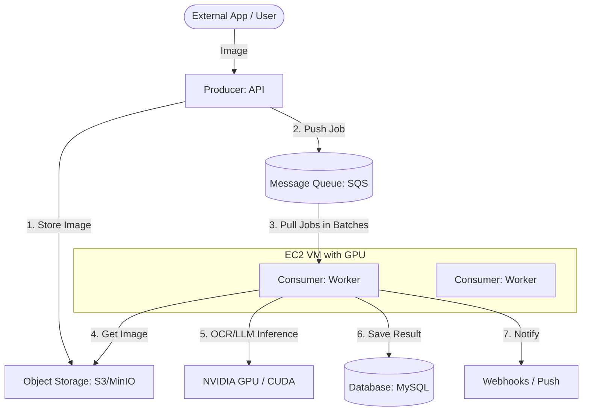

# Queue-Based Architecture Design

To achieve 1M/day throughput reliably, we use a **Producer-Consumer** pattern. This decouples image ingestion from the heavy OCR processing.

## 1. System Components

## 2. Component Details

### Producer (API Layer)

- **Tech**: FastAPI or Go.
- **Role**: Validate requests, upload file to S3, and push a job to the queue.
- **Efficiency**: The API doesn't wait for OCR. It returns a `job_id` immediately (HTTP 202 Accepted).

### Message Queue (The Buffer)

- **Tech**: **Redis** with **BullMQ** (Node.js) or **RQ** (Python).
- **Reliability**: Persistent storage. If a worker crashes, the job remains in the queue for retry.
- **Scaling**: Use multiple queues for different priorities (e.g., "express" vs "bulk" processing).

### GPU Workers (The Muscle)

- **Tech**: Python (PaddleOCR) + TensorRT.
- **Batch Inference (Critical)**: Workers should use `blpop` or similar to pull up to 32 jobs at once.
  - Loading 32 images into GPU memory in one trip is **4x faster** than processing them one by one.
- **Warm Initialization**: Models are loaded into GPU memory once on startup and never released.

## 3. Handling 1M/Day (The Math)

- **Total Seconds/Day**: 86,400.
- **Target Images/Second**: ~12.
- **Worker Capacity**: 1 Worker (T4 GPU) can handle ~5-8 images/sec with batching.
- **Required Workers**: **2 for baseline, 4 for high availability/spikes.**

## 4. Key Performance Strategies

| Feature                     | Implementation                                                                                             |
| :-------------------------- | :--------------------------------------------------------------------------------------------------------- |
| **Dead Letter Queue (DLQ)** | If an image fails 3 times (e.g., corrupted file), move to a separate queue for manual review.              |
| **Prefetching**             | Workers download the _next_ batch of images from S3 while the current batch is being processed on the GPU. |
| **Auto-scaling**            | Scale workers horizontally by adding more containers or nodes based on Queue Depth metrics.                |
| **Observability**           | Export metrics (Jobs/Sec, Failure Rate, Latency) to **Prometheus/Grafana**.                                |

## 5. Failure Recovery

1.  **S3 Upload Fails**: API returns 500; Client retries.
2.  **Queue Full**: API implement "Backpressure" (returns 503).
3.  **Worker Crash**: The job times out and is re-added to the queue after 30 seconds.
