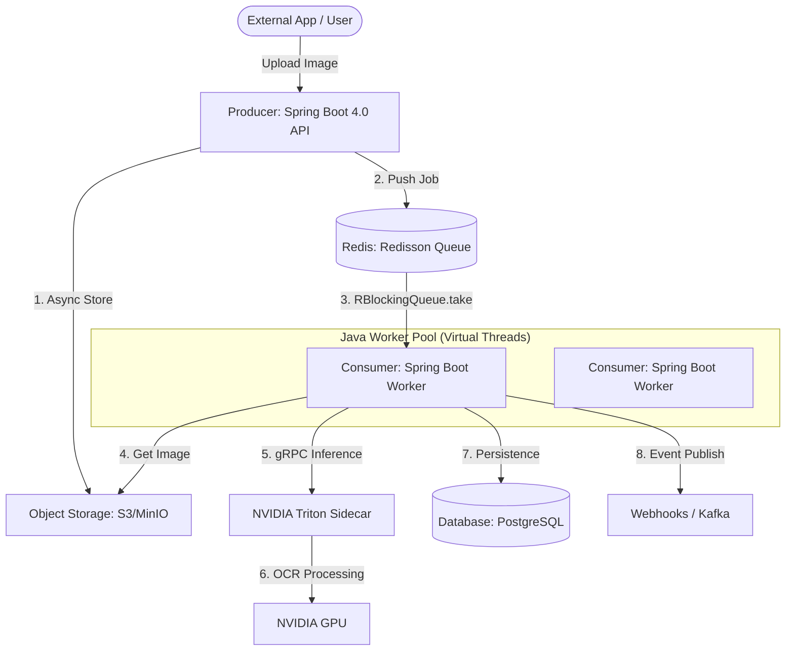

This document provides a detailed implementation roadmap for the POD OCR system using **Spring Boot 4.0.1** and Java 25+.

## 1. System Components (Java Ecosystem)

## 2. Producer (API Layer)

With **Spring Boot 4.0.1**, we leverage Virtual Threads (Project Loom) for massive concurrent ingestion.

### Implementation Stack

- **Framework**: Spring Boot 4.0.1 + Spring Web (with Virtual Threads on Java 25).
- **S3 Integration**: **AWS SDK for Java 2.x** with the `S3AsyncClient`.
- **Queue Client**: **Redisson** for distributed `RBlockingQueue`.

### Benefits of Spring Boot 4.0

- **Virtual Threads**: Replaces complex reactive (WebFlux) code with simple imperative code that scales to millions of concurrent requests.
- **HTTP Interface Clients**: Simplifies communication between the API and workers.

## 3. GPU Consumer (The Worker)

The worker polls the Redisson queue and coordinates the OCR process.

### OCR Bridge (Java to GPU)

To maintain Java's performance while using PaddleOCR:

1.  **NVIDIA Triton (Sidecar Mode)**: The worker sends gRPC requests to a Triton server. This is the most robust way to handle 1M/day. (See [sidecar_design.md](file:///Users/llewis/Code/claude-pod-recognize/sidecar_design.md) for full details).
2.  **DJL (Deep Java Library)**: Use DJL with the PaddlePaddle engine for a monolithic-style Java deployment.

## 4. Key Java Performance Strategies

| Feature                | Implementation in Java                                                              |
| :--------------------- | :---------------------------------------------------------------------------------- |
| **Virtual Threads**    | Enable `spring.threads.virtual.enabled=true` for lightweight worker threads.        |
| **Connection Pooling** | Use **HikariCP** for Postgres and optimized **Lettuce** connection pools for Redis. |
| **Serialization**      | Use **Jackson** with **Afterburner** or **Protobuf** for high-speed job parsing.    |
| **Health & Metrics**   | Use **Spring Boot Actuator** + **Micrometer** to export metrics to Prometheus.      |

## 5. Capacity Estimation (Math)

- **Throughput**: 1M/day = ~12 images/sec.
- **Spring Boot Capacity**: A single Spring Boot pod (using 2 vCPUs) can easily handle the orchestration logic for 50+ images/sec.
- **Scaling Bottleneck**: The GPU (Inference) is the bottleneck, not the Java code. Scale only the consumers based on Redis queue depth.
