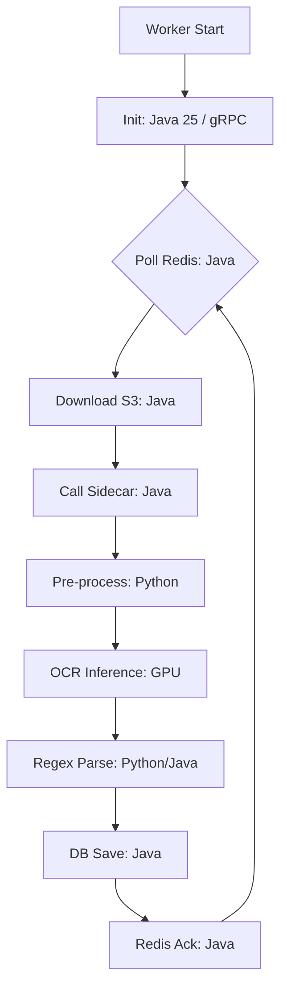
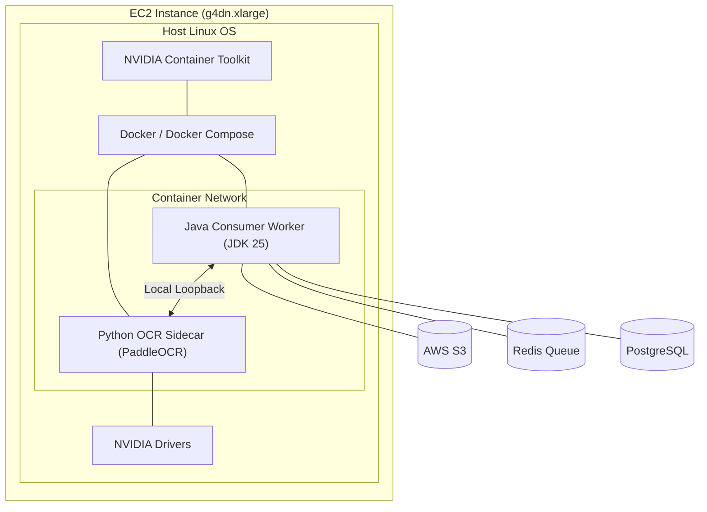

# Consumer Worker Design (Spring Boot 4.0.1)

The Consumer Worker is responsible for retrieving jobs from the queue, coordinating with the OCR Sidecar, and persisting extraction results.

## 1. System Components

- **Framework**: Spring Boot 4.0.1 (Web + Virtual Threads).
- **Queue Client**: **Redisson** (using `RBlockingQueue` for real-time processing).
- **Inference**: gRPC client for **NVIDIA Triton** or HTTP client for a **Python Sidecar**.
- **Persistence**: Spring Data JPA (PostgreSQL).

## 2. Worker Lifecycle



## 3. Implementation Details

### Batch Processing Integration

To maximize GPU efficiency, the worker should use **Batch Fetching**:

- Instead of one `take()`, use `poll(count=16)` from the Redis queue.
- Combine these 16 images into a single gRPC request if using NVIDIA Triton. This allows Triton's **Dynamic Batching** to process them in one GPU cycle.

### Pre-processing & Extraction

- **Pre-processing**: Usually kept in the Sidecar (Choice A) or Java (Choice B using OpenCV).
- **Business Logic**: Java handles the final "Address Resolution" (e.g., matching the extracted "ORCHARD CLOSE" against a master address database).

### Reliability: Retries and DLQ

- **Retry Policy**: Use **Spring Retry**. If a sidecar call fails (timeout/500), retry 3 times with exponential backoff.
- **Dead Letter Queue (DLQ)**: After 3 failed attempts, move the job to a `pod-ocr-failures` Redis list for manual inspection.
- **Error Reasons**:
  - `IMAGE_NOT_FOUND`: S3 key missing.
  - `OCR_TIMEOUT`: Sidecar didn't respond.
  - `LOW_CONFIDENCE`: Result found but confidence < 0.8.

## 4. Scalability Strategy

The consumer is **Stateless**. Scaling it is simple:

1.  **Horizontal Scaling**: Increase the number of worker containers.
2.  **Internal Concurrency**: With **Spring Boot 4.0.1** and **Java 25**, each job runs in its own **Virtual Thread**. This allows a single worker container to handle hundreds of concurrent OCR requests while waiting for I/O from S3 or the Sidecar.

## 5. Persistence Schema (Simplified)

```java
@Entity
public class PodJob {
    @Id String jobId;
    String s3Path;
    String streetNumber;
    String streetName;
    String unitNumber;
    Double confidence;
    LocalDateTime processedAt;
    JobStatus status; // ENUM: PENDING, COMPLETED, FAILED
}
```

## 6. Success Notification

Once processing is complete, the worker can optionally:

1.  Publish an event to **Kafka/RabbitMQ**.
2.  Trigger a **Webhook** back to the originating client.

## 7. GPU Consumer Deployment Chart

This visualization shows how the components are deployed on a single GPU-accelerated EC2 instance.



This chart summarizes the target deployment configuration for a single GPU-accelerated worker node (Java Worker + Python Sidecar).

| Category       | Detail            | Recommended Setting                                   |
| :------------- | :---------------- | :---------------------------------------------------- |
| **Hardware**   | EC2 Instance Type | `g4dn.xlarge` (NVIDIA T4, 16GB GPU, 4 vCPUs)          |
| **Runtime**    | Java Worker       | JVM 25, Spring Boot 4.0.1 (Virtual Threads enabled)   |
| **Runtime**    | OCR Sidecar       | Python 3.12, PaddleOCR, CUDA 11.8+                    |
| **Resources**  | Java RAM          | 2GB Heap (Xmx2g)                                      |
| **Resources**  | Python RAM        | 4GB (Model weights + image processing buffers)        |
| **GPU Access** | Docker Driver     | `nvidia` (via NVIDIA Container Toolkit)               |
| **Network**    | Communication     | `localhost:8000` (FastAPI) or `localhost:8001` (gRPC) |
| **Confg**      | `USE_GPU`         | `True` (Sidecar environment variable)                 |
| **Config**     | `REDIS_BATCH`     | `16` (Fetch up to 16 jobs from queue per loop)        |

### Environmental Variables (Worker)

- `REDIS_HOST`: Address of the Redis cache.
- `S3_BUCKET`: Name of the source image bucket.
- `OCR_SIDECAR_URL`: `http://localhost:8000` (If using Path A).
- `DATABASE_URL`: JDBC string for PostgreSQL.
