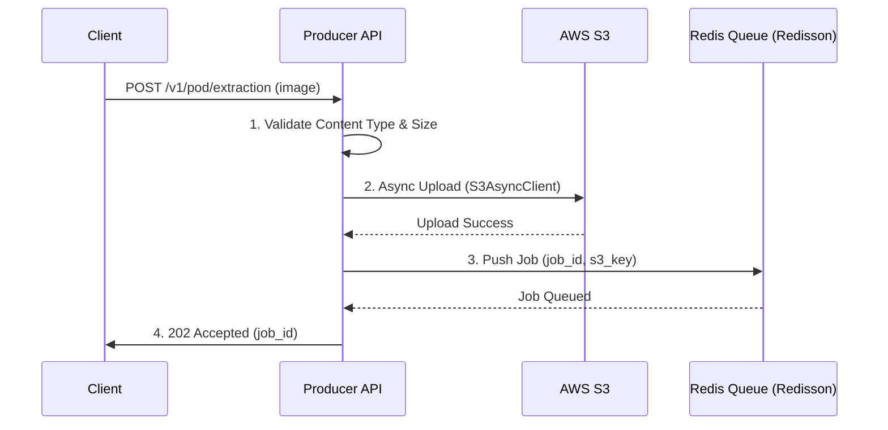

# Producer API Design (Spring Boot 4.0.1)

The Producer API is the entry point for the system. It handles image ingestion, storage, and job queuing.

## 1. API Selection

- **Protocol**: REST / JSON
- **Framework**: Spring Boot 4.0.1 (Web MVC + Virtual Threads on Java 25)
- **Security**: OAuth2 / API Key based.

## 2. Ingestion Endpoint

### `POST /v1/pod/extraction`

Submits a POD image for processing.

**Request (Multipart Form Data)**:

- `file`: The POD image (JPEG/PNG/MPEG).
- `metadata`: (Optional) JSON string containing `delivery_id`, `client_id`, etc.

**Response (202 Accepted)**:

```json
{
  "job_id": "uuid-1234-5678",
  "status": "QUEUED",
  "submitted_at": "2026-01-07T22:30:00Z",
  "links": {
    "status": "/v1/pod/jobs/uuid-1234-5678"
  }
}
```

## 3. Internal Processing Flow



## 4. Component Details

### Ingestion Logic

- **Validation**: Reject files > 5MB. Enforce image format whitelist.
- **Storage**: Images are stored in S3 using a bucket structure like `pod-uploads/{yyyy}/{mm}/{dd}/{job_id}.jpg`.
- **Queuing**: Push a JSON payload to a Redis List (or Redisson `RBlockingQueue`):
  ```json
  {
    "job_id": "uuid-1234",
    "s3_path": "pod-uploads/2026/01/07/uuid-1234.jpg",
    "priority": "normal",
    "retry_count": 0
  }
  ```

### Error Handling

| Condition         | HTTP Status             | Mitigation                                           |
| :---------------- | :---------------------- | :--------------------------------------------------- |
| **Invalid Image** | 400 Bad Request         | Inform client of unsupported format.                 |
| **S3 Error**      | 503 Service Unavailable | Circuit breaker opens; inform client to retry later. |
| **Redis Full**    | 429 Too Many Requests   | Apply backpressure; inform client to slow down.      |

## 5. Performance Checklist

- [ ] **Virtual Threads**: Enable for handling high-concurrency multipart uploads.
- [ ] **Streaming Upload**: Pipe the input stream directly to the S3 SDK without writing to disk.
- [ ] **Rate Limiting**: Implement per-tenant rate limiting using Redis during API ingestion.
