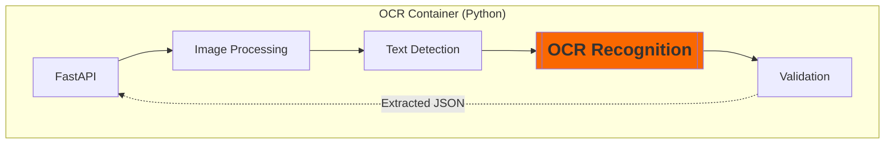

# Python Sidecar: System Components & Design

The Python Sidecar is a lightweight FastAPI wrapper around the `pod_ocr.py` script. It allows the Java Spring Boot worker to execute OCR logic over a local network interface.

## 1. System Components (Python Sidecar)



## 2. Component Responsibilities

### FastAPI / Uvicorn (The Interface)

- **Role**: Handles high-performance HTTP request/response.
- **Efficiency**: Uses `async/await` to non-blockingly handle incoming image bytes from the Java worker.
- **Port**: Usually listens on `localhost:8000`.

### OCR Logic Wrapper (The Bridge)

- **Role**: Converts the raw HTTP multi-part file into an OpenCV-compatible image array.
- **Error Handling**: Catches OCR timeouts or corrupt files and returns structured HTTP error codes (422, 500).

### OpenCV Preprocessing (The Optimizer)

- **Role**: Performs histogram equalization, grayscale conversion, and noise reduction (from our `pod_ocr.py`).
- **Why here?**: Preprocessing in Python is faster to implement and keeps the image manipulation logic unified with the OCR model.

### PaddleOCR Engine (The Brain)

- **Role**: Executes the LCNet text recognition and PP-OCR detection models.
- **Resource**: Directly communicates with the **NVIDIA CUDA** drivers / GPU.

## 3. Data Interface (The Contract)

**Request (from Java)**:

```http
POST /v1/process
Content-Type: multipart/form-data
File: [binary_image_data]
```

**Response (to Java)**:

```json
{
  "street_number": "68",
  "street_name": "ORCHARD CLOSE",
  "unit_number": null,
  "confidence": 0.985,
  "processing_time": 1.34
}
```

## 4. Scaling Logic

- **Concurrency**: Uvicorn should be configured with `workers = (2 * CPU_CORES) + 1` if CPU-bound, but for GPU-bound pods, usually **1-2 workers** is best to prevent GPU memory fragmentation.
- **Shared Volume**: For massive images, you can use a shared `/tmp` volume between the Java and Python containers to avoid sending large bytes over the loopback network.

## 5. GPU Acceleration Setup

To enable GPU usage in the Python sidecar, you must configure both the **code** and the **infrastructure**.

### Step 1: Code/Environment Enablement

The sidecar uses an environment variable to toggle the GPU. Inside the sidecar container, set:

```bash
USE_GPU=True
```

_The `pod_ocr.py` script automatically checks this variable during initialization._

### Step 2: Docker Compose Configuration

You must explicitly reserve the GPU in your `docker-compose.yml` file:

```yaml
services:
  ocr-sidecar:
    image: my-python-ocr:latest
    environment:
      - USE_GPU=True
    deploy:
      resources:
        reservations:
          devices:
            - driver: nvidia
              count: 1
              capabilities: [gpu]
```

### Step 3: Host Infrastructure

The machine (EC2/Physical) running the container must have:

1.  **NVIDIA Drivers** installed.
2.  **NVIDIA Container Toolkit** installed (allows Docker to pass CUDA kernels to the physical GPU).
