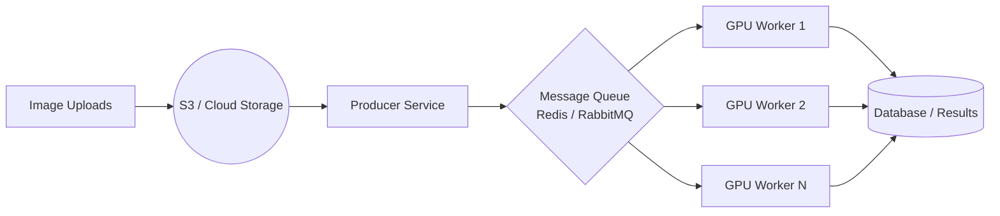

# Scaling Roadmap: 1 Million PODs / Day

To process **1,000,000 images per day**, we need to transition from a local script to a distributed, GPU-accelerated architecture.

## 1. Throughput Requirements

- **Total Images**: 1,000,000
- **Target Throughout**: ~12 images per second (11.57 avg)
- **Current Performance (CPU)**: ~1.4s per image
- **Target Performance (GPU)**: < 0.1s per image (10x faster)

## 2. OCR Engine Comparison

Choosing the right engine affects both speed and cost significantly.

| Engine           | Speed (GPU) | Accuracy  | Cost (1M/day)    | Recommendation                                               |
| :--------------- | :---------- | :-------- | :--------------- | :----------------------------------------------------------- |
| **PaddleOCR**    | **Fastest** | **High**  | ~$75 (Hardware)  | **Best overall** for self-hosted scaling.                    |
| **EasyOCR**      | Moderate    | High      | ~$150 (Hardware) | Good, but Pytorch overhead makes it slower than Paddle.      |
| **Tesseract**    | Fast (CPU)  | Low/Med   | ~$50 (Hardware)  | Not recommended for natural photos with blur.                |
| **AWS Textract** | N/A         | Very High | **$1,500+**      | Perfect if cost isn't an issue, but very expensive at scale. |

## 3. Infrastructure Shift (Transition to GPU)

The current CPU-based processing is too slow for this volume.

- **Recommended Hardware**: AWS `g4dn.xlarge` (NVIDIA T4) or `g5.xlarge` (NVIDIA A10G).
- **Inference Engine**: Use **TensorRT** or **ONNX Runtime** instead of raw PaddlePaddle for 3-5x further speedups.

## 3. Deployment Architecture

We must move from "Script-based" to "Queue-based" processing.

### Key Components:

1.  **Message Queue**: Buffer incoming traffic (spikes) and distribute tasks to workers.
2.  **Stateless Workers**: Workers keep the OCR models in GPU memory permanently (zero startup overhead).
3.  **Batch Inference**: Instead of processing 1 image at a time, workers should pull 16-32 images from the queue and process them in a single GPU call. This is **4x more efficient** on GPU.

## 4. Language & Framework Comparison

| Component                | Current (Python) | High Performance (C++/Rust) | Impact                                                                |
| :----------------------- | :--------------- | :-------------------------- | :-------------------------------------------------------------------- |
| **Logic/Orchestration**  | Python           | C++ / Go                    | **Minimal 5%**. Python is excellent for queue handling and API logic. |
| **Image Pre-processing** | OpenCV (Python)  | OpenCV (C++)                | **Medium 15-20%**. C++ handles large image resizing faster.           |
| **Model Inference**      | PaddlePaddle     | **TensorRT / ONNX (C++)**   | **Major 3x-10x**. This is the bottleneck.                             |

### Why not switch the whole language?

Switching to C++ for the entire project is high-effort for low-gain. The modern standard is a **Hybrid Approach**:

1.  **Frontend/Orchestration**: Keep in Python (FastAPI) or Go for developer velocity.
2.  **Inference**: Deploy the model on **NVIDIA Triton Inference Server** (C++ based).
    - This allows Python clients to send images to a C++ engine that handles GPU memory and batching natively.

## 5. Optimization Checklist

| Strategy                     | Impact       | Implementation                                        |
| :--------------------------- | :----------- | :---------------------------------------------------- |
| **Model Quantization**       | 2x Speedup   | Convert models to FP16 or INT8 using TensorRT.        |
| **Mobile OCR Models**        | 5x Speedup   | Use `PP-OCRv4_mobile` instead of `server`.            |
| **Region of Interest (ROI)** | 1.5x Speedup | Crop images to likely address areas before OCR.       |
| **GPU Auto-scaling**         | Reliability  | Scale workers based on Queue Depth (KEDA/Kubernetes). |

## 6. Infrastructure Recommendation

To handle 1M/day with maximum efficiency:

- **Language**: **Go** or **Python** for the API/Worker logic.
- **Inference**: **NVIDIA Triton Inference Server** with **TensorRT** backend.
- **Storage**: **Redis** for the task queue and **S3** for image storage.

## 7. Capacity Estimation

To handle 1M/day with 20% safety margin:

- **With Batching (16 images/batch)**: 2-3 NVIDIA T4 GPUs can handle 1M images/day comfortably.
- **Cost**: Total cloud cost ~ $50-$100 / day depending on reserved vs spot instances.
