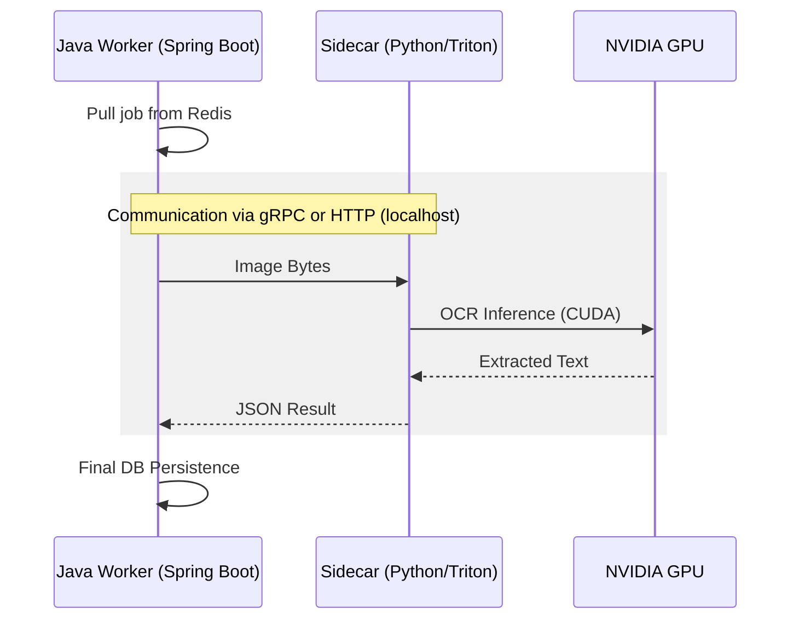

# Sidecar Architecture: Java Worker & OCR Inference

The **Sidecar pattern** is the industry-standard way to bridge high-performance Java applications with specialized Deep Learning models.

## 1. The Core Concept

A "Sidecar" is a container that runs alongside your main application. They are deployed together and communicate over the internal loopback network (`localhost`).

- **Main Container**: Your Spring Boot 4.0.1 worker.
- **Sidecar Container**: Handles the OCR logic (Choice of Python or Triton).

## 2. Two Implementation Paths

### Path A: Python Sidecar (Easiest / Fast Time-to-Market)

You wrap your existing `pod_ocr.py` in a **FastAPI** web server.

- **Python Logic**: Preprocessing, PaddleOCR call, and Regex parsing all stay in the Python script.
- **Java Worker**: Simply sends the image bytes to `http://localhost:8000/process` and receives the final JSON.
- **Verdict**: Best for rapid development and moderate scale (<500k/day).

### Path B: Triton Sidecar (Highest Throughput)

You use **NVIDIA Triton Inference Server**.

- **Python Logic**: The Python script is replaced by Triton (C++).
- **Java Worker**: You move the **Regex Parsing** and **Preprocessing** logic into your Java/SpringBoot code. Java sends raw tensors or images to Triton via gRPC.
- **Verdict**: Required for **1M+ images/day** to avoid Python's global interpreter lock (GIL).

## 3. Communication Flow



## 4. Deployment (Docker Compose)

Since you are using containers without Kubernetes, **Docker Compose** is the standard way to define the sidecar relationship.

```yaml
version: "3.8"
services:
  java-worker:
    image: my-spring-boot-ocr:latest
    depends_on:
      - ocr-sidecar
    environment:
      - OCR_URL=http://localhost:8000
    network_mode: "service:ocr-sidecar" # Shares network stack (Sidecar behavior)

  ocr-sidecar:
    image: my-python-ocr-service:latest
    deploy:
      resources:
        reservations:
          devices:
            - driver: nvidia
              count: 1
              capabilities: [gpu]
```

## 5. Key Benefits

1.  **Isolation**: Java doesn't need to know about CUDA versions or Python dependencies.
2.  **Resource Control**: You can limit the CPU/RAM of the Java worker and the Sidecar independently.
3.  **Low Latency**: Communication over `localhost` is extremely fast (measured in microseconds).
